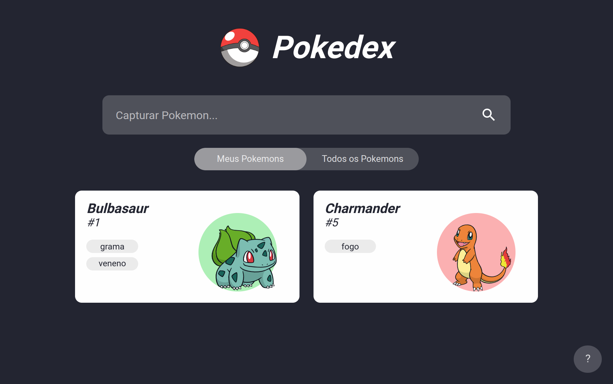

# Pokedex - CERTI Challenge

*Pokedex criada para o desafio da CERTI, com o propósito de avaliação para o processo seletivo de Desenvolvedor Full Stack. Também disponível na web [neste endereço](https://taylor-pokedex.vercel.app/)*



---

&nbsp;
## Sumário
- [Resumo](#resumo)
- [Tecnologias Utilizadas](#tecnologias-utilizadas)
- [Rodando via Imagem do Docker](#rodando-via-imagem-do-docker)
  - [Via Docker Compose](#via-docker-compose)
  - [Manualmente](#manualmente)
- [Instalação](#instalação)
- [Próximos Passos](#próximos-passos)
- [Considerações Finais](#considerações-finais)


&nbsp;
## Resumo

A Pokedex, conta com uma área de **"Meus Pokemons"** e uma área com **"Todos os Pokemons"**, podendo utilizar a **barra de pesquisa** para procurar por algum em específico. Pokemons ainda não capturados dão a opção de capturá-lo.

A captura do Pokemon se dá ao rolar um dado. Se o valor obtido for **3 ou menos, a captura falha**. Se o valor obtido for **4 ou mais, o Pokemon é capturado**, e vai para a aba dos "Meus Pokemons".


&nbsp;
## Tecnologias Utilizadas

Para a criação desta Pokedex, foram utilizadas as seguintes tecnologias:
- [Angular 13](https://angular.io/) para o [FronEnd](./frontend/README.md)
- [Node.js](https://nodejs.dev/) para o [BackEnd](./server/README.md)
  - REST API criada com [Express.js](https://expressjs.com/)
  - Conexão com Banco de Dados [MongoDB](https://www.mongodb.com/)
  - Documentação da API com [Swagger](https://swagger.io/)
- Conteinerização de FrontEnd e BackEnd com [Docker](https://www.docker.com/)


&nbsp;
## Rodando via Imagem do Docker

> Opção utilizada apenas para ver o resultado final.

A imagem do Docker que contém FrontEnd e BackEnd (servidor e API) está [disponível no Docker Hub](https://hub.docker.com/r/taylorho/pokedex). Para utilizar a imagem, é necessário configurar um banco de dados MongoDB, que pode ser realizado de duas formas:

&nbsp;
### Via Docker Compose

**1 - Clone este repositório e entre nele**
  - por ssh
```
git clone git@github.com:TaylorHo/pokedex.git && cd pokedex
```
  - ou por https
```
git clone https://github.com/TaylorHo/pokedex.git && cd pokedex
```

**2 - Acesse a pasta "example", ela contém o [docker-compose.yml](https://docs.docker.com/compose/)**
```
cd example
```

**3 - Rode o container** (-d é opcional, para deixar o console livre)
```
docker-compose up -d
```
*NOTA 1: o arquivo .env está no git pois contém apenas dados de exemplo, utilizados nos testes locais, não havendo necessidade de esconder seu conteúdo ou optar por um .env.example*

*NOTA 2: utilizando o docker compose, os dados dos Pokemons são automaticamente importados para o Banco de Dados*

**4 - Acesse a aplicação local em [http://localhost:3000/](http://localhost:3000/)**

**5 - (Opcional): Para parar o container, pode utilizar uma das seguintes opções:**
  - na pasta "example"
```
docker-compose down
```
  - via Docker (manualmente)
```
docker stop taylor_pokedex && docker stop taylor_pokedex_database
```

&nbsp;
### Manualmente

**1 - Dê um pull da [imagem do Docker Hub](https://hub.docker.com/r/taylorho/pokedex)**
```
docker pull taylorho/pokedex:latest
```

**2 - Configure um Banco de Dados [MongoDB](https://www.mongodb.com/)**, e importe a [lista de Pokemons](./example/data/pokemons.json) para uma collection chamada "pokemons".
  - Uma das maneiras mais fáceis é usar um [Cloud da própria MongoDB](https://www.mongodb.com/cloud), gratuito.

**3 - Copie a URI de conexão do Mongo para algum lugar seguro**
  - Ela se parece com algo assim: ```mongodb+srv://<usuário>:<senha>@xxxxxxxxxx.xxxxx.mongodb.net/<nome do banco de dados>```

**4 - Com a URI do Mongo em mãos, rode o seguinte comando:**
```
docker run \
  --name taylor_pokedex \
  -p 3000:3000 -d \
  -e MONGO_URI="uri_do_mongo_obtida_no_passo_3" \
  taylorho/pokedex
```
  - O valor do parâmetro ```--name``` pode ser trocado por qualquer nome que você desejar.

**5 - Acesse a aplicação local em [http://localhost:3000/](http://localhost:3000/)**

**6 - (Opcional): Para parar o container, use:**
```
docker stop taylor_pokedex
```
  - *"taylor_pokedex"* é o nome do container criado no passo 4. Se você escolheu outro nome, use ```docker stop <nome_do_container>```


&nbsp;
## Instalação

> Opção utilizada para editar o código.

Clone este repositório e entre nele
  - por ssh
```
git clone git@github.com:TaylorHo/pokedex.git && cd pokedex
```
  - ou por https
```
git clone https://github.com/TaylorHo/pokedex.git && cd pokedex
```

Dentro da pasta do projeto, temos alguns arquivos e pastas principais:

```
pokedex
│   Dockerfile
│
└───server
│   
└───frontend
```

- [Dockerfile](./Dockerfile): Instruções de build da imagem do Docker
- [frontend](./frontend/README.md): Parte visual da aplicação (em Angular)
- [server](./server/README.md): API e servidor da build do frontend

No caso das pastas server e frontend, você pode acessar seus respectivos README.md (clicando nos links acima). Já o Dockerfile tem seu funcionamento explicado em comentários no prórpio arquivo.


&nbsp;
## Próximos Passos

> Pontos que seriam interessantes adicionar/melhorar no projeto.

- Implementar Loading Screen
  - Enquanto o frontend está fazendo o fetch dos Pokemons
- Desenvolver os testes unitários
  - Está com eles minimamente desenvolvidos, apenas o básico
- Fazer a tipagem dos Pokemons no frontend
  - Como é um objeto extenso, foi utilizado *any* como tipo do Typescript, o que **precisa** ser mudado
- Mecanismo de cache no frontend ([HttpInterceptor](https://angular.io/api/common/http/HttpInterceptor))
  - Para reduzir o consumo da API e tornar a experiência do usuário mais rápida e suave


&nbsp;
## Considerações Finais

> Uma opinião pessoal sobre o desenvolvimento do projeto.

Existem diversos [Javascript Frameworks](https://developer.mozilla.org/pt-BR/docs/Learn/Tools_and_testing/Client-side_JavaScript_frameworks) disponíveis atualmente, e até então o que eu mais vinha usando era o [React](https://reactjs.org/), por sua facilidade de ser usado.
Ao realizar este projeto, percebi o quanto o [Angular](https://angular.io/) já se desenvolveu desde a última vez que havia o utilizado e sinceramente me surpreendi com os resultados!

Independendemente de passar no processo seletivo ou não, tenho a certeza de que vou continuar utilizando Angular em projetos futuros, devido à alguns aspectos como praticidade, velocidade, consistência e organização (este ponto em específico que considero muito mais avançado que no React).

Então, deixo aqui meus agradecimentos por proporcionarem este reencontro com o Framework =)

&nbsp;
### Projeto em Flutter

Durante a entrevista técnica, também foi comentada a possibilidade de realizar uma aplicação parecida com essa, mas com [Flutter](https://flutter.dev/), para demonstrar meus conhecimentos com este Dart Framework.

Infelizmente tive contratempos (complicações de saúde) durante a realização da Pokedex em Angular (este projeto), e por isso optei por não realizar o desafio de Flutter (visto que não sobraria tempo para tal).

Por este motivo, deixo alguns trabalhos meus em Flutter para caso queiram dar uma olhada:

- [Abnormal World](https://abnormal-world.vercel.app/#/) (jogo ainda em desenvolvimento)
  - É um projeto privado, por isso não irei disponibilizar o repositório.
  - Ainda está em desenvolvimento, mas da parte que está pronta, tenho builds para Android, Web, Linux e Windows (falta apenas para MacOS e IOS, visto que não tenho um Mac para buildar para plataformas da Apple)
- [Julia's Art Gallery](https://github.com/TaylorHo/art_gallery)
  - Link da versão para web [aqui](https://taylorho.github.io/art_gallery/)
  - Foi um presente para minha namorada, outro jogo.

&nbsp;
### Obrigado pela atenção!